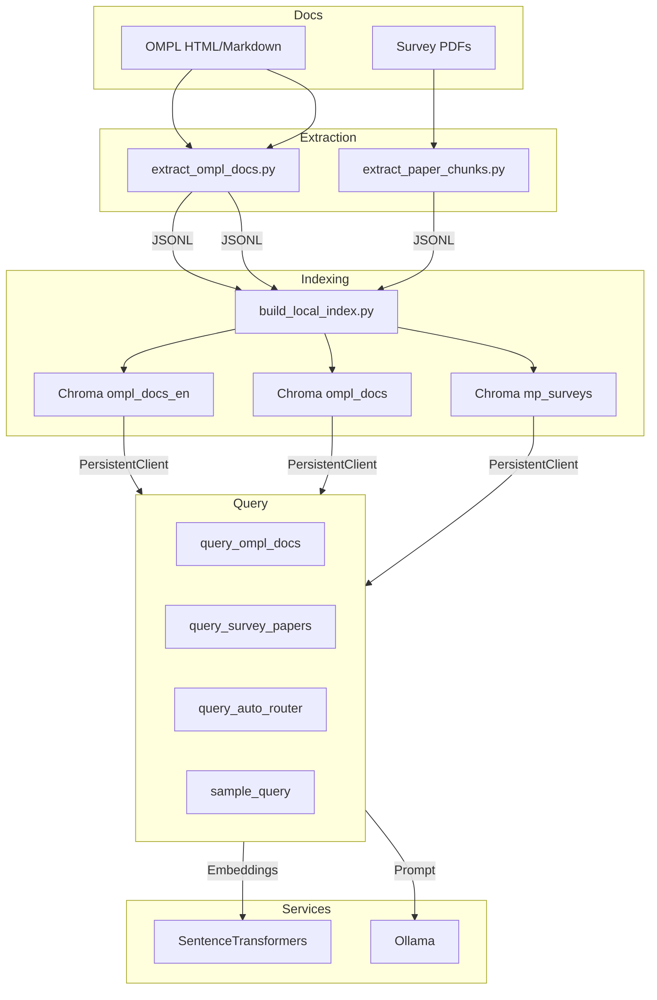
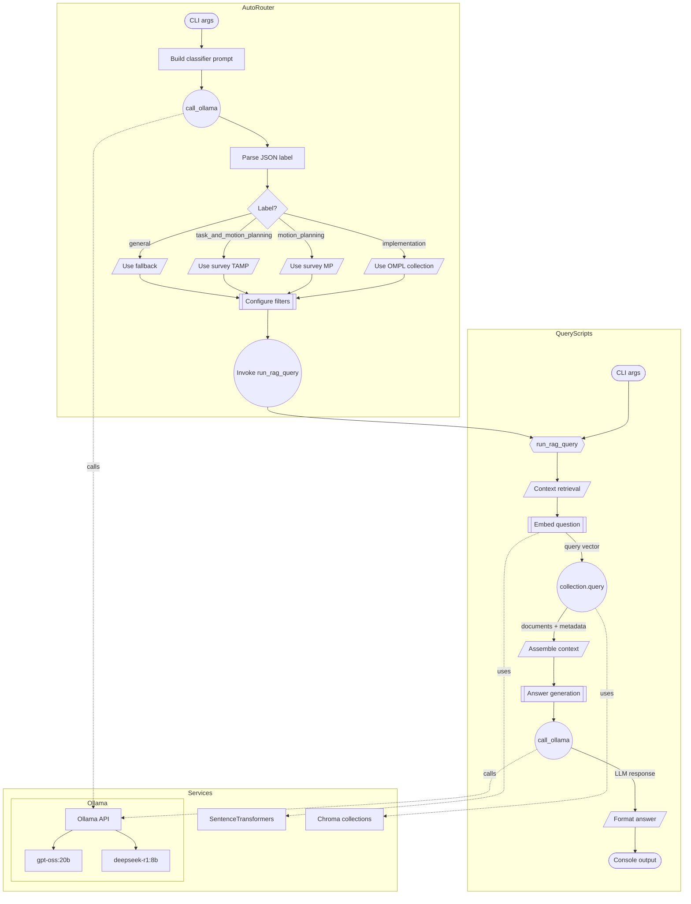

# DH: OMPL + Survey support system

本リポジトリは、OMPL ドキュメントとモーションプランニング／タスク＆モーションプランニング（TAMP）のサーベイ論文を材料にしたローカル RAG（Retrieval-Augmented Generation）構築セットです。Ollama 上の LLM をバックエンドに、以下の機能を備えています。

- OMPL Doxygen HTML/Markdown・サーベイ PDF をメタデータ付き JSONL に変換する抽出スクリプト。
- SentenceTransformers + Chroma によるベクトルインデックスの構築 (`ompl_docs_en`, `mp_surveys` など)。
- コレクション固有の問い合わせ CLI（OMPL 専用 / Survey 専用 / AutoRouter）。
- AutoRouter では LLM にコレクション概要を提示し、`implementation`/`motion_planning`/`task_and_motion_planning`/`general` を判定 → 適切なコレクションへリダイレクト。質問が実装寄りであれば OMPL API ベースの回答プロンプトを付与し、概念的な質問ならサーベイ資料を引用した回答を生成します。

## System Overview

- **Document Extraction**
  - `scripts/extract_ompl_docs.py`: OMPL Doxygen HTML/Markdown からチャンクを生成し、`rag_data/ompl_doc_chunks.jsonl` を出力。
  - `scripts/extract_paper_chunks.py`: `paper/` のサーベイ PDF を解析してセクション/文献メタデータ付きチャンクを作成、`rag_data/survey_papers_chunks.jsonl` へ出力。
- **Vector Indexing (Chroma)**
  - `scripts/build_local_index.py`: JSONL チャンクを SentenceTransformers で埋め込み、`.chroma` 内のコレクション（例: `ompl_docs_en`, `mp_surveys`）へ永続化。
- **Query Interface**
  - `scripts/query_ompl_docs.py`, `scripts/query_survey_papers.py`: Chroma から類似チャンクを取得し、Ollama LLM で回答生成。
  - `scripts/query_auto_router.py`: 各コレクションの概要（Implementation/OMPL、Motion Planning Survey、Task & Motion Survey）を LLM に渡し、`implementation`/`motion_planning`/`task_and_motion_planning`/`general` へ分類して適切なコレクションへルーティング。
  - `scripts/sample_query.py`: `ompl_docs_en` を利用した代表的な問い合わせフロー。
- **Supporting Services**
  - SentenceTransformers: `sentence-transformers/all-mpnet-base-v2`（英語）や `paraphrase-multilingual-MiniLM-L12-v2`（多言語）。
  - Chroma: `.chroma` ディレクトリに永続化されたベクトルコレクション。
   - PersistentClient: Chroma の永続ストレージ（`PersistantClient(path=...)`）へ接続し、コレクションを取得・`upsert`/`query` する Python クライアント。
  - Ollama: `deepseek-r1:8b` / `gpt-oss:20b` などのローカル LLM API。



## What is OMPL?

Open Motion Planning Library（OMPL）は、サンプリングベースのモーションプランニングアルゴリズムを体系的に集めたオープンソースライブラリです。プランナーの実装に特化しており、環境表現・干渉チェック・可視化などは意図的に含まず、MoveIt や OMPL.app など別フレームワークへ容易に統合できる構造になっています（`ompl/doc/markdown/mainpage.md.in`）。PRM や RRT 系をはじめ多様なプランナー、各種状態空間・サンプラ、最適化目的を備えており、ROS/MoveIt を通じた産業ロボットの軌道生成から教育用途まで幅広く利用されています。


## How to Setup

### LLMのLocal API endpointを建てる

1. ollamaをinstall
```
curl -fsSL https://ollama.com/install.sh | sh
```
2. モデルのDownload
   1. 今回は2つ、`gpt-oss:20b`と`deepseek-r1:8b` を使用
   ```
   ollama pull ${MODEL_NAME}
   ```

3. start ollama model
```
ollama run ${MODEL_NAME}
```

4. (optional) stop ollama model
```
ollama stop ${MODEL_NAME}
```

### Python 仮想環境（uv + venv）

> git clone 直後に最低限必要な手順です。

1. uv を持っていない場合のみインストール。
   ```bash
   curl -LsSf https://astral.sh/uv/install.sh | sh
   ```
2. リポジトリ直下で仮想環境を作成（キャッシュ先は任意のローカルパスで OK）。
   ```bash
   UV_CACHE_DIR=.uv-cache uv venv .venv
   ```
3. 仮想環境を有効化し、`pyproject.toml`/`uv.lock` に記載された依存を同期する。
   ```bash
   source .venv/bin/activate
   UV_CACHE_DIR=.uv-cache uv sync
   ```
   ※ `uv sync` は初回と依存更新時のみ。以降は `source .venv/bin/activate` だけで利用可能。
4. 追加でパッケージを入れる場合は `uv add <package>` を使う。  
   - 本プロジェクトでは埋め込みに `sentence-transformers/paraphrase-multilingual-MiniLM-L12-v2`、ベクトル DB として Chroma を利用。


### DoxygenからOMPLのドキュメントを生成する手順

1. git clone git@github.com:ompl/ompl.git

1. 事前準備  
   - `doxygen` と `graphviz` をインストールする（例: `sudo apt install doxygen graphviz`）。  
   - `boost`, `cmake`, `eigen`, `yaml-cpp` など OMPL の基本依存も揃えておく。
2. ビルド用ディレクトリを用意する。
   ```bash
   cd ompl
   mkdir -p build/doc
   cd build/doc
   cmake ../..
   ```
3. Doxygen ターゲットをビルドする。
   ```bash
   cmake --build . --target ompl_doc -j$(nproc)
   ```
4. 生成結果は `ompl/build/doc/ompl_doc` に出力される。`index.html` をブラウザで開けばオフラインドキュメントを確認できる。
5. ソースを更新した場合も同じ `cmake --build . --target ompl_doc` を実行するだけで差分を再生成できる。


### RAG ドキュメントアシスタントの着手ログ

1. `ompl/doc/markdown` と `ompl/build/doc/ompl_doc` の内容を平文化してチャンク化するスクリプト `scripts/extract_ompl_docs.py` を追加した。
2. 以下のコマンドで JSONL（`rag_data/ompl_doc_chunks.jsonl`）を生成した。必要であれば同じコマンドを再実行してドキュメントの更新を取り込める。
   ```bash
   python3 scripts/extract_ompl_docs.py \
       --html-dir ompl/build/doc/ompl_doc \
       --markdown-dir ompl/doc/markdown \
       --output rag_data/ompl_doc_chunks.jsonl
   ```
   実行結果（例）: `Wrote 19027 chunks from 2556 documents to .../rag_data/ompl_doc_chunks.jsonl`

### Extractionの工夫（commit: “performance improve by changing parsing algorithm of extraction”）

- 従来: Doxygen HTML をそのままテキスト化＋固定長チャンクに分割していたため、ナビゲーションや JavaScript 断片が混ざり、クラスや関数単位の情報が分断されていた。またメタデータは `doc_type` 程度で、クエリから目的のシンボルへ結び付けるのが困難だった。
- 改善: BeautifulSoup を用いて `div.contents` など主要コンテンツだけ抽出。`Title/Kind/Symbol/Namespace` をチャンク冒頭へ埋め込み、`kind`/`symbol`/`namespace` をメタデータとして JSONL に保持。チャンク長もヘッダ単位で制御し、不要なヘッダ・スクリプトを除去してノイズを削減した。
- 効果: Retriever が `ompl::multilevel` などシンボル名で検索した際にヒット精度が向上し、LLM へ渡すコンテキストも読みやすくなった。今後はこのメタデータを活用してクエリ種類ごとのルーティングやハイブリッド検索へ発展させる予定。


### ローカル RAG インデックス構築と問い合わせ

1. ベクトルインデックスの作成（Chroma 永続化）  
   ```bash
   python3 scripts/build_local_index.py \
       --chunks rag_data/ompl_doc_chunks.jsonl \
       --persist-dir .chroma \
       --collection-name ompl_docs_en \
       --model-name sentence-transformers/all-mpnet-base-v2 \
       --reset
   ```

   - `--reset` で再構築前に既存コレクションを削除。  
   - `--batch-size` や `--model-name` で埋め込み条件を調整。日本語/多言語クエリを重視する場合は `--collection-name ompl_docs --model-name sentence-transformers/paraphrase-multilingual-MiniLM-L12-v2` を指定して再構築する。
2. Ollama でホストしている LLM を使って質問  
   ```bash
   python3 -m scripts.query_local_rag \
       "OMPLで推奨される最適化プランナーは？" \
       --ollama-model deepseek-r1:8b \
       --persist-dir .chroma \
       --collection-name ompl_docs_en
   ```
   - 取得したチャンクと回答が CLI に表示される。  
   - デフォルトは `deepseek-r1:8b`。必要に応じて `--ollama-model gpt-oss:20b` などへ変更可能。`--top-k` でコンテキスト件数も調整できる。質問文に「namespace」「class」「tutorial」などが含まれると `kind` メタデータを自動フィルタとして利用（無効化する場合は `--no-auto-filter` を指定）。回答は英語＋日本語訳の2部構成で返される。
3. サンプルプログラムで一連の流れを確認  
   ```bash
   python3 -m scripts.sample_query
   ```
   - 事前に `.venv` を有効化し、Ollama のモデルを起動しておく必要があります。

### Survey 論文のチャンク化とインデックス

1. PDF からセクション構造を保った JSONL を生成。  
   ```bash
   python3 scripts/extract_paper_chunks.py \
       --pdf-dir paper \
       --output rag_data/survey_papers_chunks.jsonl
   ```
   - PyMuPDF で目次 (TOC) を読み、`paper_title` / `section_title` / `page_start` などのメタデータを保持。TOC が無い場合は論文全体を 1 セクションとしてチャンク化。本文末尾で “References” / “Bibliography” / “Literature Cited” などの見出しを検出して自動的に再分割し、番号付き文献を1件ずつまとめてチャンク化するため、文献リストの途中で切れることがない。
2. Survey コレクションを作成。  
   ```bash
   python3 scripts/build_local_index.py \
       --chunks rag_data/survey_papers_chunks.jsonl \
       --persist-dir .chroma \
       --collection-name mp_surveys \
       --model-name sentence-transformers/all-mpnet-base-v2 \
       --reset
   ```
   - 日本語主体で検索したい場合は `--model-name sentence-transformers/paraphrase-multilingual-MiniLM-L12-v2` など多言語モデルに切り替える。

### クエリユーティリティ

> `scripts/` ディレクトリをパッケージ化しているため、CLI は `python -m scripts.<module>` 形式で実行するのが推奨です（これにより `rag` パッケージが自動で解決されます）。

- OMPL ドキュメント専用  
  ```bash
  python3 -m scripts.query_ompl_docs "OMPLの最適化プランナーは？"
  ```
  - デフォルトで英語向け `ompl_docs_en` コレクション（`all-mpnet-base-v2` 埋め込み）を使用。日本語での検索精度を上げたい場合は `--collection-name ompl_docs --model-name sentence-transformers/paraphrase-multilingual-MiniLM-L12-v2` などを指定。
- Survey 論文専用  
  ```bash
  python3 -m scripts.query_survey_papers \
      "Task and Motion Planning の最前線は？" \
      --topic task_and_motion_planning
  ```
  - どの論文のどのページが引用されたかが `paper_title` / `page_start` として表示される。
- 自動ルーティング  
  ```bash
  python3 -m scripts.query_auto_router "タスク計画とモーション計画を統合する方法は？"
  ```
  - LLM へ各コレクション（Implementation/OMPL docs、Motion Planning サーベイ、Task & Motion サーベイ）の概要・代表的な見出しをコンテキストとして渡し、`implementation` / `motion_planning` / `task_and_motion_planning` / `general` のいずれかに自動分類してからルーティング。`implementation` 判定時は実装寄りの質問として扱い、OMPL API や設定手順にフォーカスした回答プロンプトを自動付与。`general` 判定時の処理（OMPL / Survey / Skip）は `--default-general-target` で設定。

#### Query Programs Internals



### Source Code Description

- `scripts/extract_ompl_docs.py`  
  - 目的: OMPL の Doxygen HTML と Markdown を平文化してチャンク化し、RAG 用の JSONL を生成する。  
  - 概要: 依存ライブラリなしの簡易 HTML パーサーでテキスト抽出 → 余分な空白を正規化 → 1,200 文字程度のチャンクに分割（重なりあり） → メタデータ（`source`, `title`, `kind`, `symbol`, `namespace`, `chunk_index` など）付きで `rag_data/*.jsonl` に出力。これらのメタデータは `auto_filter` や AutoRouter の `metadata_filter` で直接活用される。  
  - 実行例: `python3 scripts/extract_ompl_docs.py --html-dir ompl/build/doc/ompl_doc --markdown-dir ompl/doc/markdown --output rag_data/ompl_doc_chunks.jsonl`

- `scripts/build_local_index.py`  
  - 目的: チャンク化済み JSONL を埋め込み、Chroma のコレクションへ永続化する。  
  - 概要: SentenceTransformer によるバッチ埋め込み → `collection.upsert` で `.chroma` に保存。`--reset` でコレクション再作成が可能。英語前提のためデフォルトは `sentence-transformers/all-mpnet-base-v2`、日本語を重視する場合は CLI 引数で多言語モデルに切り替える。  
  - 実行例: `python3 scripts/build_local_index.py --chunks rag_data/ompl_doc_chunks.jsonl --persist-dir .chroma --collection-name ompl_docs --reset`

- `scripts/query_local_rag.py`  
  - 目的: Chroma から関連チャンクを取得し、Ollama 上の LLM（例: `deepseek-r1:8b`）で回答を生成する。  
  - 概要: SentenceTransformer でクエリをベクトル化 → Top-k を取得 → 文脈を整形して Ollama `/api/generate` に送信 → 応答と引用情報を表示。質問文に応じて `kind` メタデータ（namespace/class/function 等）を推定し、関連チャンクを優先的に取得する仕組みを追加。また回答フォーマットを英語→日本語訳の2部構成で固定し、研究者と日本語話者の双方に共有しやすい形にした。  
  - 実行例: `python3 -m scripts.query_local_rag "OMPLのプランナー一覧を教えて" --ollama-model deepseek-r1:8b`

- `scripts/sample_query.py`  
  - 目的: 代表的な RAG 質問フローをまとめて確認できる最小のサンプル。  
  - 概要: `run_query` を呼び出し、決め打ちの質問に対するコンテキストと回答を標準出力へ表示する。  
  - 実行例: `python3 -m scripts.sample_query`

- `scripts/extract_paper_chunks.py`  
  - 目的: `paper/` 内のサーベイ PDF からセクション構造付きテキストを抽出し、RAG 用 JSONL を作成する。  
  - 概要: PyMuPDF で TOC を解析 → セクションごとにページ範囲と階層レベルを付与 → `paper_title`/`section_title`/`section_level`/`page_start`/`page_end`/`topic` などのメタデータを保持したまま重なり付きチャンクを生成。Reference/Bibliography/Literature Cited のような見出しを自動検出して本文末尾を切り出し、番号付き文献単位でチャンク化。タイトルに含まれるキーワードから `topic` を推定し、AutoRouter や `metadata_filter` による `motion_planning` / `task_and_motion_planning` 絞り込みに利用できる。  
  - 実行例: `python3 scripts/extract_paper_chunks.py --pdf-dir paper --output rag_data/survey_papers_chunks.jsonl`

- `scripts/query_ompl_docs.py` / `scripts/query_survey_papers.py` / `scripts/query_auto_router.py`  
  - 目的: OMPL コレクション、サーベイコレクション、分類付き自動ルーティングの 3 系統を個別に CLI から呼び出す。  
  - 概要: 共通の `run_rag_query` を使い、必要に応じて `topic` フィルタや分類結果をメタデータに反映。`query_auto_router.py` はコレクション概要（OMPL API の代表項目や各サーベイ論文名など）を LLM に渡し、`implementation` / `motion_planning` / `task_and_motion_planning` / `general` のどれに該当するかを JSON で受け取って Implementation/OMPL ドキュメント（実装寄り回答プロンプト付き）またはサーベイ（トピック指定付き）へ自動ルーティングする。  
  - ルーティング詳細:  
    - `implementation`: `collection_name=ompl_docs_en` / `metadata_filter=None` / `answer_instructions` に実装フォーカスの追加プロンプト。OMPL API やクラス名を参照しながら手順を説明する回答を促す。  
    - `motion_planning`: `collection_name=mp_surveys` / `metadata_filter={"topic": {"$eq": "motion_planning"}}`。Motion Planning サーベイのみを検索対象にし、概念・比較・研究動向に関する回答を生成。  
    - `task_and_motion_planning`: `collection_name=mp_surveys` / `metadata_filter={"topic": {"$eq": "task_and_motion_planning"}}`。TAMP サーベイに限定したコンテキストで回答。  
    - `general`: `--default-general-target` の設定に従い、OMPL / Survey / Skip を選択。OMPL/Survey を選んだ場合はそれぞれ上記の設定を流用、Skip なら `run_rag_query` を呼ばずに終了。  
  - 実行例: `python3 -m scripts.query_auto_router "TAMPの研究動向は？" --default-general-target survey`

- `rag/query_pipeline.py`  
  - 目的: RAG クエリ実行・文脈整形・Ollama 呼び出し・LLM 分類の共通処理をモジュール化。  
  - 概要: `run_rag_query` が SentenceTransformers でクエリを埋め込み → Chroma `PersistentClient` で `collection.query` → `format_context` でコンテキスト整形 → Ollama で最終回答を生成する一連の流れを提供。フィルタ適用に失敗した場合はフェイルオーバーして再クエリし、`QueryResult`（context, answer, inferred_kind, applied_filter, fallback_used）を返す。`classify_question` は各コレクションの概要を含むプロンプトを作成し、Ollama から `implementation`/`motion_planning`/`task_and_motion_planning`/`general` の JSON ラベルと理由を取得する補助関数。  
  - 主な引数: `run_rag_query(question: str, *, persist_dir: str = ".chroma", collection_name: str, model_name: str = "sentence-transformers/all-mpnet-base-v2", ollama_model: str = "deepseek-r1:8b", ollama_url: str = "http://localhost:11434", top_k: int = 5, temperature: float = 0.1, auto_filter: bool = True, metadata_filter: Optional[Dict] = None, answer_instructions: Optional[str] = None)`
